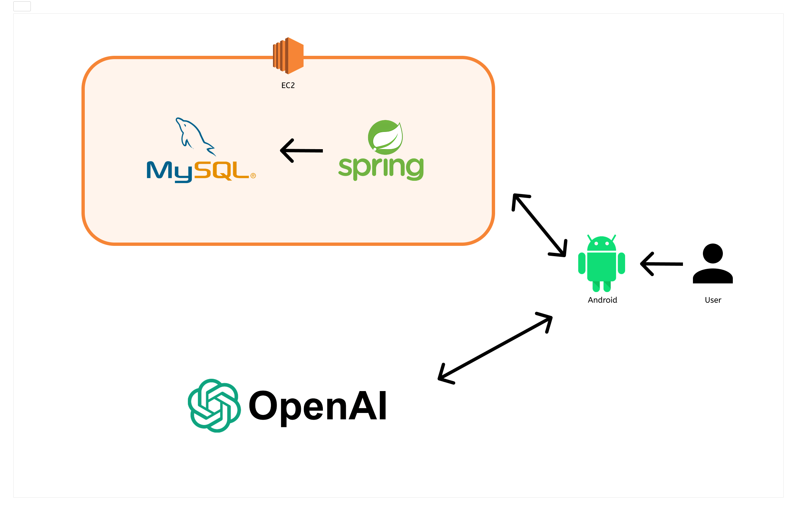

# TEAM NHCafe

### ☕ 음성인식 기반 AI 무인 카페 앱 "NHCafe"

> 무인 매장·키오스크 확산 속, **디지털 약자를 위한 음성 중심 주문**  
> **말로 주문하고, 말로 안내받는** 사용자 친화적 무인 카페

 

## 📑 목차
1. [프로젝트 소개](#-프로젝트-소개)
2. [주요 기능](#-주요-기능)
3. [주요 화면 및 기능 소개](#-주요-화면-및-기능-소개)
4. [생성형 AI 적용 내용 및 결과](#-생성형-ai-적용-내용-및-결과)
5. [적용 패턴 및 구조](#-적용-패턴-및-구조)
6. [기술 스택](#-기술-스택)
7. [시스템 아키텍처](#%EF%B8%8F-시스템-아키텍처)
8. [팀원 정보](#-팀원-정보)

 

## 📋 프로젝트 소개

**NHCafe**는 음성 인식과 TTS(Text-to-Speech)를 결합해, **버튼 터치 없이도 대화로 주문**할 수 있는 **AI 무인 카페 앱**입니다.  
무인 매장과 키오스크의 빠른 확산이 **디지털 약자에게 높은 진입 장벽**이 되는 문제에서 출발해,  
**사용자 친화적 음성 인터페이스**, **음성 안내/접근성 강화**, **AI 기술과 모바일 플랫폼의 융합**을 목표로 구현했습니다.

### 프로젝트 정보
| 항목 | 내용 |
| --- | --- |
| 서비스명 | NHCafe |
| 기획 배경 | 무인 매장/키오스크 확산 → 디지털 약자 접근성 문제 → **음성 기반 대화형 주문** 필요성 |
| 목표 | 사용자 친화적 음성 UI, 음성 안내(TTS)로 접근성 강화, 모바일·AI 융합 |
| 기간 | 2024.**05** ~ 2024.**05** |
| 인원 | 2명 |
| 역할 | **모바일(Android) + AI 적용(대화/추천/TTS)** |

 

## ✨ 주요 기능

1. **대화형 주문(Voice-First)**  
   - “아메리카노 톨 사이즈로 한 잔”처럼 **자연어로 메뉴 인식**  
   - 주문 내역 **자동 구성/확인/수정** 대화 흐름 제공

2. **음성 안내(TTS) & 접근성**  
   - 주문 단계, 옵션 선택, 결제 전 확인을 **TTS로 음성 안내**  
   - 시각적 UI와 **청각 안내를 동시 제공**해 가독성/접근성 강화

3. **추천 메뉴**  
   - **GPT 프롬프트**로 실제 메뉴 중 **3가지 추천**  
   - 시간대/선호/이전 주문 맥락을 반영(프롬프트 정책)

4. **무터치 흐름**  
   - 앱 진입 → 음성 웨이크/시작 → 주문 → 확인 → 결제 안내까지 **버튼 없이 진행**(선택적 터치 병행)

5. **관리/운영(선택)**  
   - 품절/이벤트/혼잡 안내 문구를 **대화 중 동적 반영**(백엔드 연동 시)

 

## 🚀 주요 화면 및 기능 소개

- **온보딩/마이크 권한**: 첫 설정, 접근성 가이드  
- **대화형 주문 화면**: 음성 입력 → 자연어 이해(NLU) → 주문 카드 자동 구성  
- **옵션/수정**: “샷 하나 추가해줘”, “시럽 빼줘” 같은 **자연어 수정** 지원  
- **주문 확인 & 결제 안내**: 최종 내역 낭독(TTS), 결제 단계로 안내  
- **추천/탐색**: “추천해줘”, “따뜻한 메뉴로 추천” 질의 대응

  
  
  

 

## 🤖 생성형 AI 적용 내용 및 결과

### 1) 적용 모델
- **GPT-4o (OpenAI API)**  
- **Text Completion + TTS(Text-to-Speech)** 연동

### 2) 적용 기능
- **AI 음성 대화 주문**: 사용자의 **음성 입력 → 텍스트 변환** → GPT로 의도/슬롯 해석 → 주문 구성  
- **음성 안내(TTS)**: GPT 응답/주문 상태를 **음성으로 낭독**해 시각적·청각적 안내 동시 제공  
- **추천 메뉴 안내**: GPT 프롬프트로 **실제 메뉴 중 3가지 추천**(시간대/취향 반영 정책)

### 3) 결과 & 효과
- **무터치 주문 흐름** 구현 → 키오스크 조작이 어려운 사용자도 사용 가능  
- **TTS 안내**로 고령층/시각장애 사용자 **접근성 향상**  
- 대화형 수정/확인으로 **오주문 감소** 및 **이탈률 저감** 기대

 

## 🧩 적용 패턴 및 구조

- **MVVM**: Jetpack Compose에 맞춘 **View(Compose) – ViewModel – Model** 분리  
- **Repository Pattern**: `ViewModel ↔ Repository(API)` 분리로 테스트/유지보수 용이  
- **네트워킹 레이어**: Retrofit 기반, 응답/에러 공통 처리  
- **상태 관리**: UI 상태(State)·이벤트를 단방향 흐름으로 관리  
- **음성 파이프라인**: **STT(음성→텍스트)** → **GPT 해석/응답** → **TTS(텍스트→음성)**

> STT 구현체(Android OS API/클라우드 STT 등)는 프로젝트 환경에 맞게 연결.

 

## 📚 기술 스택

### 📱 프론트엔드(Android)
- **Kotlin**, **Android Studio**
- **Jetpack Compose**
- 아키텍처: **MVVM**, Repository
- 네트워킹: **Retrofit / OkHttp**
- 접근성: TTS, (필요 시) 자막/텍스트 미러링

### ⚙️ 백엔드/서버
- **Java**, **Spring Boot**
- **MyBatis + MySQL**
- **AWS EC2** 배포

### 🤖 AI
- **GPT-4o** (OpenAI API)
- Text Completion + **TTS** 연동

 

## 🏗️ 시스템 아키텍처

- **App(Android)**  
  └ STT(음성→텍스트) → **GPT-4o** 대화/추천 → TTS(텍스트→음성)  
- **Backend(Spring Boot)**  
  └ 메뉴/재고/주문 API, MyBatis + MySQL  
- **Infra**  
  └ AWS EC2 배포

> 실제 연결 방식(직접 OpenAI 호출 vs 서버 경유)은 운영 정책에 맞게 선택.

 

## 👨‍👩‍👧‍👦 팀원 정보
| 이름 | 역할 | 메일 |
| --- | --- | --- |
| 송진우 | **Android · AI 대화/추천 · TTS 연동 · 배포** | rkddkwl059@naver.com |
| 홍은솔 | 백엔드(Spring) · DB  | eunsolhh@gmail.com |
